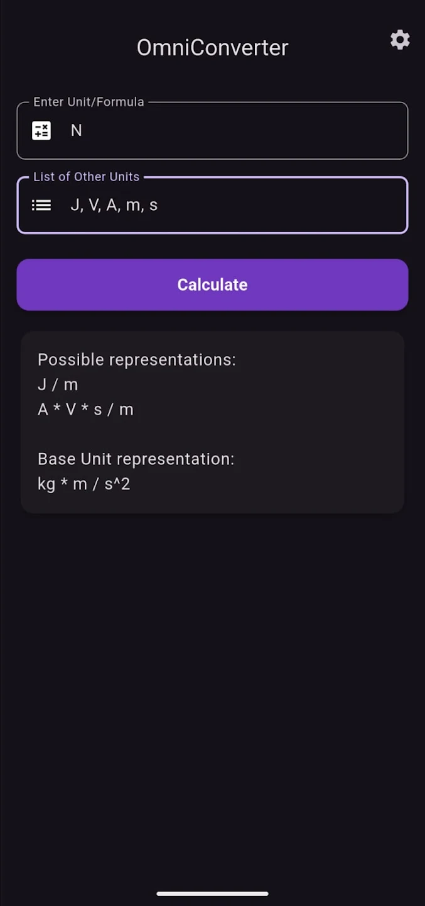
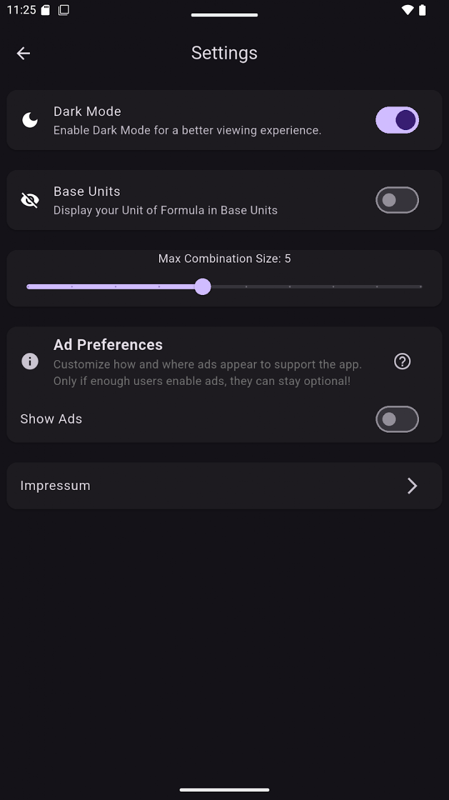

# OmniConverter

A converter for physical units - but not in the way you might think right now ;)

It handles unit *compositions* — breaking a unit like N (Newton) down into its
components (e.g. kg·m/s² or A·V·s/m), but it can also go the other way and
represent a combination using different SI units. Want to express N/Ω using
J, V, A and m? It can be represented as A·J/(V·m).

It's fully open-source and free, written in Flutter. Ads can be enabled in the
app in case you'd like to support me a little.

## Screenshots

## Installation

## Features

- Convert between physical units by finding SI-consistent representations
- Break down composite units (like N) into their base components
- Re-express a unit combination using a different set of SI units
- Adjustable settings (e.g. max combination size) to tune how results are found
- Optional ads, toggleable in settings, to support development

## Contributing

Contributions are welcome! Feel free to:

- Open an [issue](../../issues) for bugs or feature requests
- Submit a pull request with a fix or improvement

By submitting a pull request, you agree that your contribution can be
included in the project under the same license as the rest of the code (see
below).

## License

This project uses a custom source-available license (see [LICENSE](LICENSE)).
In short:

- ✅ Use the app freely
- ✅ Modify it, fork it, open issues, submit pull requests
- ✅ Reuse any code snippet from it in your own projects, as long as you keep
  a reference to me (Quirin Stetten) somewhere
- ❌ Don't republish, sell, or redistribute the app itself (or a repackaged
  version of it) under your own name

If you're unsure whether your use case is fine, just open an issue and ask.
